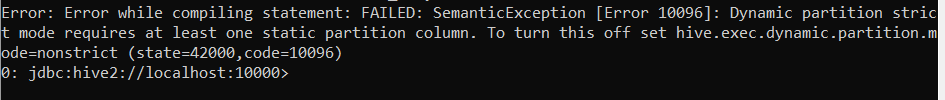

<div align="center">
  
</div>

<div style='text-align: right; color: #666666'>Projeto Final da Formação Big Data Engineer</div>

<h1 align="center" style="color: #990099">
Campanha Nacional de Vacinação contra COVID-19
</h1>

<div style="text-align: right;">
<i>Fonte de dados:</i> <a href="https://covid.saude.gov.br/">https://covid.saude.gov.br/</a>
</div>


### **Arquivos CSV**


* HIST_PAINEL_COVIDBR_2020_Parte1_06jul2021.csv (59,5 MB aprox.)

* HIST_PAINEL_COVIDBR_2020_Parte2_06jul2021.csv (72,9 MB aprox.)

* HIST_PAINEL_COVIDBR_2021_Parte1_06jul2021.csv (86,8 MB aprox.)

* HIST_PAINEL_COVIDBR_2021_Parte2_06jul2021.csv (02,9 MB aprox.)

  

---

### **Ambiente do Projeto**


*Máquina Usada*

* Processador Intel Core i7
* Memória RAM 20GB
* Sistema Operacional 64bits (Windows 10)
* Docker
* Subsistema para Linux (Ubuntu Instalado)
* WSL 2 integrado ao Docker

*Docker*

* Cluster: https://github.com/rodrigo-reboucas/docker-bigdata.git


**Preparando o ambiente**

Acesse o Ubuntu instalado pelo menu de programas do Windows.

<div align="center">
  
</div>


**Baixando o Git**

Instalando o git no Linux (Ubuntu)

```bash
$ sudo apt-get update
$ sudo apt-get install git
$ git –version
```


**Baixando o arquivo de configuração do Cluster (Docker)**

Agora que temos o Git instalado, podemos baixar o cluster e usar todo o poder do Docker.

```bash
$ mkdir covid19
$ cd covid19
$ git clone https://github.com/rodrigo-reboucas/docker-bigdata.git .
```


**Baixando as Imagens do Docker e Subindo o Cluster**

Agora vamos baixar todas as imagens e subir o cluster

```bash
$ docker-compose -f docker-compose-parcial.yml pull    
$ docker-compose -f docker-compose-parcial.yml up -d   
```


---

### Propostas do Projeto

#### 1. Enviar os dados para o hdfs

Copiando os arquivos de dados csv para a pasta criada no Linux com o nome covid19.

Baixei os arquivos *.csv para a área de trabalho do meu computador, em razão deste users e sidnei (nome do meu usuário).

```bash
$ cd input
$ sudo cp /mnt/c/users/Sidnei/desktop/*.csv .
```

Acessando o namenode e criando a pasta /covid19/data

```bash
$ docker cp HIST_PAINEL_COVIDBR_2020_Parte1_06jul2021.csv namenode:/input
$ docker cp HIST_PAINEL_COVIDBR_2020_Parte2_06jul2021.csv namenode:/input
$ docker cp HIST_PAINEL_COVIDBR_2021_Parte1_06jul2021.csv namenode:/input
$ docker cp HIST_PAINEL_COVIDBR_2021_Parte2_06jul2021.csv namenode:/input
$ docker exec -it namenode bash
$ hdfs dfs -mkdir -p /user/covid19
$ hdfs dfs -put /input/*.csv /user/covid19
$ hdfs dfs -ls /user/covid19
```


#### 2. Otimizar todos os dados do hdfs para uma tabela Hive particionada por município.

```bash
$ docker exec -it hive-server bash
$ beeline -u jdbc:hive2://localhost:10000
$ show databases;
$ create database covid19;
$ use covid19;
$ show tables;
```

Criando a tabela para manipular os dados dos arquivos .csv

```mariadb
create table covid_csv(
regiao string, 
estado string, 
municipio string, 
coduf int, 
codmum int, 
codRegiaoSaude int, 
nomeRegiaoSaude string, 
data string, 
semanaEpi int, 
populacaoTCU2019 int, 
casosAcumulado int, 
casosNovos int, 
obitosAcumulado int, 
obitosNovos int, 
Recuperadosnovos int, 
emAcompanhamentoNovos int, 
interiorMetropolitana int
)
row format delimited
fields terminated by ';'
lines terminated by '\n'
stored as textfile
location '/user/covid19'
tblproperties('skip.header.line.count'='1');
```

Criando tabela tbl_covid para receber os dados particionados por municipio.

```mariadb
create table tbl_covid(
regiao string, 
estado string, 
data string, 
casosAcumulado int, 
casosNovos int, 
obitosAcumulado int, 
obitosNovos int, 
Recuperadosnovos int, 
emAcompanhamentoNovos int 
) 
partitioned by (municipio string)
stored as textfile;
```
Inserindo os dados particionando por municipio.

```mariadb
insert overwrite table tbl_covid 
partition(municipio) 
select 
regiao, 
estado, 
data, 
casosAcumulado, 
casosNovos, 
obitosAcumulado, 
obitosNovos, 
Recuperadosnovos, 
emAcompanhamentoNovos,
municipio
from covid_csv;
```

Ao fazer essa tentativa, recebi o seguinte erro:

<div align="center">
  
</div>

Habilitei as seguintes configurações no hive:

```scala
set hive.exec.dynamic.partition = true;
set hive.exec.dynamic.partition.mode = nonstrict;
```

E repeti novamente "insert overwrite table tbl_covid ..." porem recebi o seguinte erro.

<div align="center">
  
</div>


#### 3. Criar as 3 visualizações pelo Spark com os dados enviados para o HDFS:

#### 4. Salvar a primeira visualização como tabela Hive

#### 5. Salvar a segunda visualização com formato parquet e compressão snappy

#### 6. Salvar a terceira visualização em um tópico no Kafka

#### 7. Criar a visualização pelo Spark com os dados enviados para o HDFS:

#### 8. Salvar a visualização do exercício 6 em um tópico no Elastic

#### 9. Criar um dashboard no Elastic para visualização dos novos dados enviados

---

**Nota**

Senhores avaliadores, devido ao problema mencionado acima não consegui prosseguir com a resolução dos itens restantes.

Fiquei **sábado** 06/11 e **domingo** 07/11 tentando resolver esse problema porem não obtive êxito.

Como trabalho durante a semana, não foi possível resolver tudo antes do prazo estipulado.

Entretanto ,mesmo depois do término do prazo vou tentar prosseguir com a resolução desse projeto. Tenho interesse em colocar esse projeto em meu portfolio, contribuindo com minha evolução pessoal dentro dos conhecimentos adquiridos durante essa jornada. 

Foram muitas semanas de muito conhecimento e aprendizado que vão amadurecer diante de desvios como esse. 

Já adquiri o livro *Apache Hive Essentials - Dayong Du* para aprimorar os conhecimentos sobre Hive e assim entender mais sobre essa tecnologia.


Sou muito grato pela aprendizado e pela oportunidade. Espero um dia poder contribuir também.


Abraço a todos.

Sidnei Monteiro da Silva Filho
sialkas@gmail.com